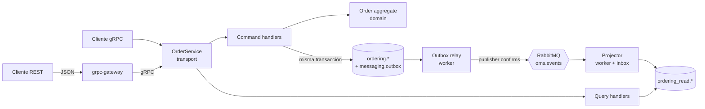

# OMS — boilerplate de APIs Go empresariales

Plantilla para construir APIs en Go con **gRPC como contrato principal** y **REST para los clientes**, aplicando **DDD, CQRS y arquitectura orientada a eventos (EDA)** sobre **PostgreSQL** y **RabbitMQ**, con **observabilidad completa** (trazas, métricas y logs) y todo ejecutable en local con Docker.

El ejemplo es un **OMS (Order Management System) multi-tenant**: varias empresas comparten la plataforma y sus datos están aislados en la base de datos con row-level security.

> **Sota, caballo y rey.** Toda funcionalidad sigue exactamente la misma forma y los mismos pasos. Añadir un caso de uso es mecánico: [docs/sota-caballo-rey.md](docs/sota-caballo-rey.md).

## Arranque rápido

Requisitos: Go 1.27+, Docker (con Compose v2) y `make`.

```bash
make up        # construye y levanta todo: API, worker, Postgres, RabbitMQ y observabilidad
make smoke     # crea, consulta, lista y cancela un pedido vía REST
make test      # tests unitarios con -race
make test-integration   # tests end-to-end contra el stack levantado
```

| Servicio | URL |
|---|---|
| REST (grpc-gateway) | http://localhost:8080/v1/orders |
| gRPC (reflection activa) | `localhost:9090` |
| OpenAPI | http://localhost:8080/openapi.json · Swagger UI: http://localhost:8082 |
| Grafana (dashboard "OMS overview") | http://localhost:3300 |
| Jaeger (trazas) | http://localhost:16686 |
| Prometheus | http://localhost:9091 |
| RabbitMQ management | http://localhost:15672 (`oms` / `oms_local`) |

Todas las llamadas de negocio necesitan la cabecera `X-Tenant-Id` (UUID):

```bash
curl -X POST localhost:8080/v1/orders \
  -H 'X-Tenant-Id: 8b5d3c1e-7d6f-4c2a-9a59-0d7f3c0b2a11' -H 'Content-Type: application/json' \
  -d '{"idempotencyKey":"k-1","customerId":"c-1","currencyCode":"EUR",
       "lines":[{"sku":"SKU-1","quantity":2,"unitPriceMinor":1999}]}'
```

Para desarrollar con los binarios en el host: `make infra`, y después `make run-api` y `make run-worker` en dos terminales.

## Cómo está hecho, en una imagen



- **gRPC first**: los `.proto` de `api/proto` son la única fuente de verdad. De ellos se generan el servidor gRPC, las rutas REST (anotaciones `google.api.http`) y el OpenAPI.
- **CQRS**: los comandos escriben el modelo de escritura y devuelven solo IDs. Las consultas leen una proyección desnormalizada que mantiene el worker a partir de los eventos (consistencia eventual, normalmente milisegundos).
- **EDA fiable**: un *transactional outbox* garantiza que no hay evento sin estado ni estado sin evento. El *inbox* hace a los consumidores idempotentes. Las colas son *quorum* con *dead-letter* automático.
- **Multi-tenant**: el tenant viaja en el contexto y PostgreSQL lo impone con RLS. Aunque el código tuviera un bug, una consulta no puede leer datos de otro tenant.

## Mapa del repositorio

```text
api/proto/oms/order/v1/   contrato: servicio, recursos y eventos de integración
gen/                      código generado (no editar): Go, gateway y OpenAPI
cmd/api                   proceso API: gRPC :9090 + REST :8080
cmd/worker                proceso worker: outbox relay + consumidores
internal/app              lista de bounded contexts (único sitio que se toca al añadir uno)
internal/ordering/        bounded context "ordering"
  domain/                 agregado Order, value objects, eventos, puerto Repository
  application/command/    casos de uso de escritura
  application/query/      casos de uso de lectura + puerto ReadModel
  application/projection/ proyector de eventos → modelo de lectura
  infrastructure/         Postgres (escritura y lectura) y codec de eventos protobuf
  transport/grpcapi/      adaptador gRPC (solo mapeo)
  module.go               composición del contexto
internal/platform/        kernel técnico compartido (ddd, cqrs, apperr, tenancy,
                          postgres, outbox, inbox, rabbitmq, grpcx, gateway, telemetry)
migrations/               SQL versionado (golang-migrate)
deploy/                   configuración de Postgres, OTel Collector, Prometheus y Grafana
test/e2e                  tests de integración (build tag "integration")
docs/                     arquitectura, recetas, ADRs y operación
```

## Documentación

| Documento | Para qué |
|---|---|
| [docs/architecture.md](docs/architecture.md) | Capas, reglas de dependencia y flujos de petición y evento |
| [docs/sota-caballo-rey.md](docs/sota-caballo-rey.md) | Receta paso a paso para añadir comandos, queries, eventos y bounded contexts |
| [docs/api.md](docs/api.md) | Convenciones del contrato: errores, paginación, idempotencia y versionado |
| [docs/events.md](docs/events.md) | Outbox, topología de RabbitMQ, reintentos, DLQ y orden |
| [docs/multitenancy.md](docs/multitenancy.md) | Aislamiento por RLS y cómo pasar a tenants autenticados por JWT |
| [docs/observability.md](docs/observability.md) | Trazas, métricas, logs y qué mirar cuando algo falla |
| [docs/operations.md](docs/operations.md) | Desarrollo local, configuración, migraciones y runbooks |
| [docs/adr/](docs/adr/) | Decisiones de arquitectura y sus porqués |

## Comandos

`make help` los lista todos. Los principales son `proto` (regenerar el contrato), `lint`, `test`, `check` (lo que corre la CI), `up`, `down`, `reset` (borra datos), `logs` y `migrate-new NAME=...`.
