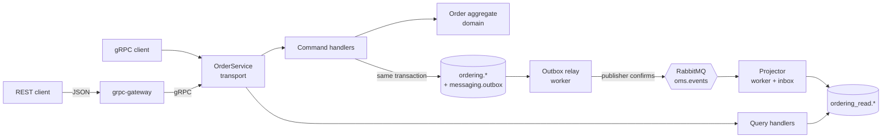

# OMS — enterprise Go API boilerplate

A template for building Go APIs with **gRPC as the primary contract** and **REST for clients**, applying **DDD, CQRS and event-driven architecture (EDA)** on **PostgreSQL** and **RabbitMQ**, with **full observability** (traces, metrics and logs). Everything runs locally with Docker.

The example domain is a **multi-tenant OMS (Order Management System)**: many companies share the platform and their data is isolated inside the database with row-level security.

> **One shape for every feature.** Every feature follows the same structure, in the same places, in the same order. Adding a use case is mechanical: [docs/feature-playbook.md](docs/feature-playbook.md).

## Quick start

Requirements: Go 1.27+, Docker (Compose v2) and `make`.

```bash
make up                 # build and start everything: API, worker, Postgres, RabbitMQ, observability
make smoke              # place, read, list and cancel an order through REST
make test               # unit tests with -race
make test-integration   # end-to-end tests against the running stack
```

| Service | URL |
|---|---|
| REST (grpc-gateway) | http://localhost:8080/v1/orders |
| gRPC (reflection enabled) | `localhost:9090` |
| OpenAPI | http://localhost:8080/openapi.json · Swagger UI: http://localhost:8082 |
| Grafana ("OMS overview" dashboard) | http://localhost:3300 |
| Jaeger (traces) | http://localhost:16686 |
| Prometheus | http://localhost:9091 |
| RabbitMQ management | http://localhost:15672 (`oms` / `oms_local`) |

Every business call requires the `X-Tenant-Id` header (a UUID):

```bash
curl -X POST localhost:8080/v1/orders \
  -H 'X-Tenant-Id: 8b5d3c1e-7d6f-4c2a-9a59-0d7f3c0b2a11' -H 'Content-Type: application/json' \
  -d '{"idempotencyKey":"k-1","customerId":"c-1","currencyCode":"EUR",
       "lines":[{"sku":"SKU-1","quantity":2,"unitPriceMinor":1999}]}'
```

To develop with the binaries on the host: `make infra`, then `make run-api` and `make run-worker` in two terminals.

## The design at a glance



- **gRPC first**: the `.proto` files in `api/proto` are the single source of truth. The gRPC server, the REST routes (`google.api.http` annotations) and the OpenAPI document are all generated from them.
- **CQRS**: commands write the write model and return identifiers only. Queries read a denormalised projection that the worker maintains from events (eventually consistent, typically milliseconds).
- **Reliable EDA**: a *transactional outbox* guarantees there is never state without its event or an event without its state. The *inbox* makes consumers idempotent. Queues are *quorum* queues with automatic *dead-lettering*.
- **Multi-tenant**: the tenant travels in the request context and PostgreSQL enforces it with RLS. Even a buggy query cannot read another tenant's data.

## Repository map

```text
api/proto/oms/order/v1/   contract: service, resources and integration events
gen/                      generated code (do not edit): Go, gateway and OpenAPI
cmd/api                   API process: gRPC :9090 + REST :8080
cmd/worker                worker process: outbox relay + consumers
internal/app              list of bounded contexts (the only place touched to add one)
internal/ordering/        "ordering" bounded context
  domain/                 Order aggregate, value objects, events, Repository port
  application/command/    write use cases
  application/query/      read use cases + ReadModel port
  application/projection/ event projector → read model
  infrastructure/         Postgres (write and read) and protobuf event codec
  transport/grpcapi/      gRPC adapter (mapping only)
  module.go               composition root of the context
internal/platform/        shared technical kernel (ddd, cqrs, apperr, tenancy,
                          postgres, outbox, inbox, rabbitmq, grpcx, gateway, telemetry)
migrations/               versioned SQL (golang-migrate)
deploy/                   Postgres, OTel Collector, Prometheus and Grafana configuration
test/e2e                  integration tests ("integration" build tag)
docs/                     architecture, playbook, ADRs and operations
```

## Documentation

| Document | Purpose |
|---|---|
| [docs/architecture.md](docs/architecture.md) | Layers, dependency rules, request and event flows |
| [docs/feature-playbook.md](docs/feature-playbook.md) | Step-by-step recipes for commands, queries, events and bounded contexts |
| [docs/api.md](docs/api.md) | Contract conventions: errors, pagination, idempotency, versioning |
| [docs/events.md](docs/events.md) | Outbox, RabbitMQ topology, retries, DLQ and ordering |
| [docs/multitenancy.md](docs/multitenancy.md) | RLS isolation and moving to JWT-authenticated tenants |
| [docs/observability.md](docs/observability.md) | Traces, metrics, logs and where to look when something breaks |
| [docs/operations.md](docs/operations.md) | Local development, configuration, migrations and runbooks |
| [docs/adr/](docs/adr/) | Architecture decisions and their rationale |

## Commands

`make help` lists them all. The main ones are `proto` (regenerate the contract), `lint`, `test`, `check` (what CI runs), `up`, `down`, `reset` (deletes data), `logs` and `migrate-new NAME=...`.

## License

[0BSD](LICENSE): use, copy, modify and distribute for any purpose, with or without attribution.
